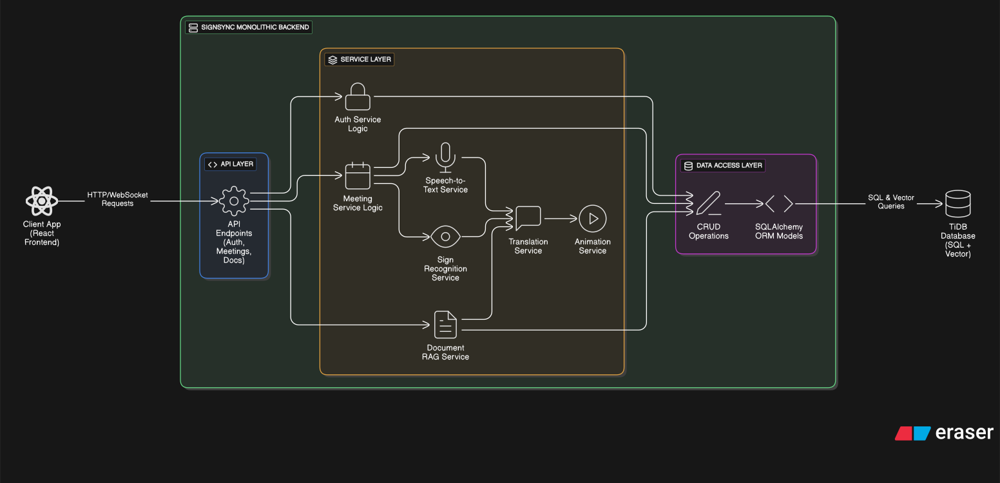

# SignSync System Architecture

## 1. Overview

SignSync is a communication platform designed to facilitate interaction between deaf and hearing individuals. The system is built on a **monolithic architecture**. This approach was chosen to streamline development, simplify deployment, and reduce operational complexity.

While the application is a single, unified service, it is designed with a highly **modular internal structure** to ensure the codebase remains clean, maintainable, and scalable. This modularity also allows for a potential future transition to a microservices architecture if needed.

The platform supports two primary functionalities:

- **Real-Time Meeting Translation**: A live meeting environment where sign language is translated into spoken words, and spoken words are translated into 3D sign language animations.  
- **Document Explanation**: A tool that allows users to upload documents and receive explanations for selected text in sign language.  

---

## 2. Technology Stack
- 🎨 **Frontend**: React (for a dynamic and responsive user interface).  
- 🖐️ **3D Rendering**: Three.js (via react-three-fiber) for rendering 3D hand animations in the browser.  
- 🐍 **Backend**: Python, using the FastAPI framework for its high performance and asynchronous capabilities.  
- 🗄️ **Database**: TiDB (a distributed, MySQL-compatible SQL database chosen for its horizontal scalability and integrated vector search capabilities).  
- 📡 **Real-time Communication**: WebRTC (for peer-to-peer video/audio streaming) and WebSockets (for signaling and data streaming).  

---

## 3. Backend Architecture: The Monolith
The entire backend is a **single FastAPI application**. All business logic, from user authentication to complex AI processing, is contained within this single codebase and runs as one process. This eliminates network latency between components and simplifies data consistency.

Communication between different logical parts of the application is handled through **direct Python function and class calls**. For long-running, computationally expensive tasks, such as video processing or AI model inference, we leverage **FastAPI’s `BackgroundTasks`** (or dedicated workers if needed) to ensure the main server thread remains non-blocking and responsive.

---

### 3.1 Modular Structure

The backend codebase is organized into a **layered and modular structure** to maintain a clear separation of concerns:

---

#### `main.py`
- **Purpose**: Entry point of the backend.  
- **Responsibilities**: Initializes the FastAPI app, registers routers, applies middleware (CORS, logging, error handlers), and sets up the database connection.  

---

#### `app/api/`
- **Purpose**: The API layer (HTTP + WebSocket endpoints).  
- **Responsibilities**:  
  - Defines feature-specific routers (`auth.py`, `meetings.py`, `documents.py`, etc.).  
  - Validates requests with Pydantic schemas.  
  - Delegates logic to service-layer functions.  
  - Provides WebSocket routes for chat and real-time meeting events.  

---

#### `app/core/`
- **Purpose**: Application-wide configuration and utilities.  
- **Responsibilities**:  
  - `config.py`: Loads environment variables (DB URLs, secrets, API keys).  
  - `security.py`: Handles password hashing, JWT authentication.  
  - `database.py`: Manages database session lifecycle (SQLAlchemy + TiDB).  
  - `logger.py`: Centralized logging configuration.  
  - `utils.py`: Generic utility functions.  

---

#### `app/models/`
- **Purpose**: Database schema (ORM).  
- **Responsibilities**:  
  - Each file represents a table from the ER diagram (`user.py`, `meeting.py`, `document.py`, etc.).  
  - Uses SQLAlchemy ORM to define relations, constraints, and indexes.  

---

#### `app/schemas/`
- **Purpose**: Data validation and serialization.  
- **Responsibilities**:  
  - Pydantic models for input validation and response shaping.  
  - Separate request/response DTOs to ensure consistent API contracts.  

---

#### `app/crud/`
- **Purpose**: Database access layer (CRUD).  
- **Responsibilities**:  
  - Encapsulates raw DB queries and operations.  
  - Provides clean methods for higher-level services (e.g., `get_user_by_email`, `list_meetings_for_user`).  

---

#### `app/services/`
- **Purpose**: Business logic layer.  
- **Responsibilities**: Implements all feature-specific logic.  
  - `auth_service.py`: Handles authentication & authorization.  
  - `meeting_service.py`: Manages meeting lifecycle, participants, recording flags.  
  - `chat_service.py`: Real-time chat handling and persistence.  
  - `document_service.py`: Document upload, storage, and processing.  
  - `translation_service.py`: Coordinates sign ↔ speech/text translation.  
  - `ai_service.py`: Runs ML models for embeddings, gesture recognition, etc.  

---

#### `app/realtime/`
- **Purpose**: Real-time communication modules.  
- **Responsibilities**:  
  - `signaling.py`: WebRTC signaling logic.  
  - `websocket.py`: WebSocket event handling for chat & meeting updates.  
  - `rtc_manager.py`: Session and peer connection management.  

---

#### `app/workers/` (optional, for async jobs)
- **Purpose**: Background/async processing tasks.  
- **Responsibilities**:  
  - `transcription.py`: Runs speech-to-text models asynchronously.  
  - `sign_render.py`: Generates 3D sign animations.  
  - `embeddings.py`: Handles text embedding and TiDB vector search.  

---

#### `tests/`
- **Purpose**: Unit and integration testing.  
- **Responsibilities**:  
  - Feature-specific test files (`test_auth.py`, `test_meetings.py`, etc.).  
  - Ensures system reliability and prevents regressions.  
