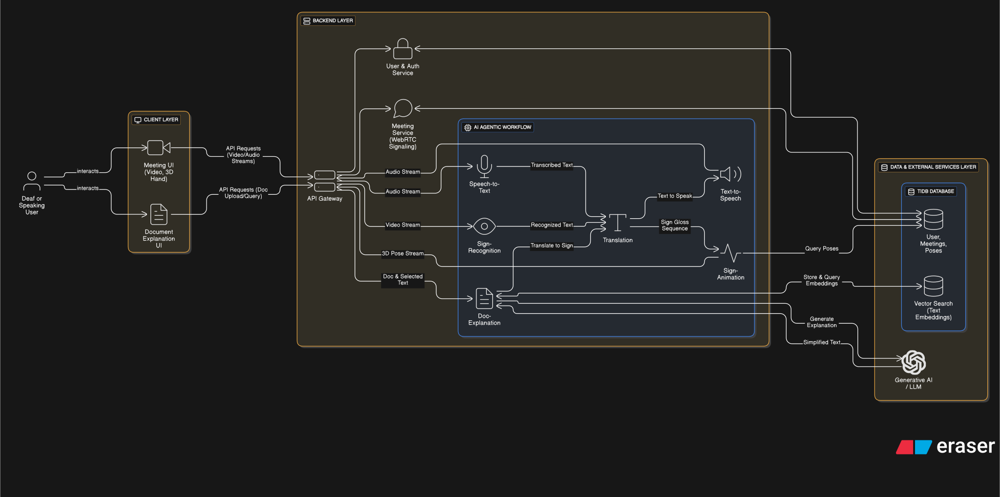

# SignSync System Architecture

## 1. Overview

SignSync is a communication platform designed to facilitate interaction between deaf and hearing individuals. The system is built on a **microservices architecture** to ensure scalability, maintainability, and independent deployment of its various components.

This architecture supports two primary functionalities:

- **Real-Time Meeting Translation**: A live meeting environment where sign language is translated into spoken words, and spoken words are translated into 3D sign language animations.
- **Document Explanation**: An offline tool that allows users to upload documents and receive explanations for selected text in sign language.

The system is logically divided into three core layers:
- **Client Layer**: The user interface.
- **Backend Layer**: Business logic and AI processing.
- **Data Layer**: Data persistence and retrieval.

---

## 2. Technology Stack
- **Frontend**: React (dynamic and responsive UI).
- **3D Rendering**: Three.js (via react-three-fiber) for 3D hand animations in the browser.
- **Backend**: Python with FastAPI (asynchronous and high performance).
- **Database**: TiDB (distributed, MySQL-compatible SQL database with integrated vector search).
- **Real-time Communication**: WebRTC (video/audio streaming) & WebSockets (signaling/data streaming).
- **Inter-Service Communication**: RabbitMQ (message broker for asynchronous communication).

---

## 3. Backend Layer: Microservices & AI Agents
The backend is the **core of the platform**, composed of independent services and AI agents.

- **Asynchronous communication** between agents via RabbitMQ ensures **low latency and high throughput**.
- **Synchronous REST APIs** handle direct client interactions requiring immediate responses.

### 3.1 Core Services

#### API Gateway
**Purpose**: Unified entry point for client requests.  
**Responsibilities**:
- Request routing
- Authentication (JWT verification)
- Load balancing
- API composition (aggregating multiple responses)

#### User & Auth Service
**Purpose**: User management, security, and identity.  
**Responsibilities**:
- Registration & credential verification (password hashing)
- JWT generation & validation
- CRUD operations for user profiles
- Direct interaction with `users` table in TiDB

#### Meeting Service
**Purpose**: Orchestrates real-time meeting sessions.  
**Responsibilities**:
- Create, start, and end meeting rooms
- Manage participants and roles
- **WebRTC signaling** via WebSockets:
  - Exchange SDP offers/answers and ICE candidates
  - Establish peer-to-peer media connections (service brokers but does not process media streams)

### 3.2 Agentic AI Workflow
A collection of **specialized AI agents**, each deployed as an independent microservice. They communicate asynchronously using the message broker.

#### Sign-Recognition Agent
**Purpose**: Interpret sign language from video.  
**Process**:
1. Receive real-time video stream.
2. Use computer vision (e.g., MediaPipe) for hand landmark detection.
3. Feed skeletal data into deep learning model (LSTM/Transformer).
4. Output recognized sign as text "gloss" (e.g., `HELLO-WAVE`).
5. Publish result to message queue.

#### Speech-to-Text Agent
**Purpose**: Transcribe spoken audio into text.  
**Process**:
1. Receive audio stream.
2. Use ASR model (e.g., OpenAI Whisper).
3. Publish transcribed text to message queue.

#### Translation Agent
**Purpose**: Convert between sign glosses and spoken text.  
**Process**:
1. Subscribe to Sign-Recognition & Speech-to-Text outputs.
2. Use LLM to:
   - Convert glosses → spoken language.
   - Convert spoken text → gloss sequences.
3. Publish translated glosses to queue.

#### Sign-Animation Agent
**Purpose**: Render 3D sign animations.  
**Process**:
1. Subscribe to Translation Agent output.
2. Query `sign_poses` table in TiDB for 3D pose data.
3. Concatenate pose frames into continuous animation sequence.
4. Stream animation data (JSON) to client via WebSocket.

#### Text-to-Speech Agent
**Purpose**: Convert text into speech audio.  
**Process**:
1. Subscribe to spoken text from Translation Agent.
2. Use TTS engine (e.g., Google TTS).
3. Stream synthesized audio back to client.

#### Document-Explanation Agent
**Purpose**: RAG pipeline for document analysis.  
**Process**:
1. **Ingestion**: Split uploaded document into chunks.
2. **Vectorization**: Embed chunks with model (e.g., `text-embedding-ada-002`).
3. **Storage**: Save chunks + embeddings in `document_chunks` table (TiDB).
4. **Retrieval**: Vector search for relevant chunks based on user query.
5. **Generation**: LLM produces simple explanation.
6. Pass explanation to Translation Agent → Sign-Animation pipeline.
