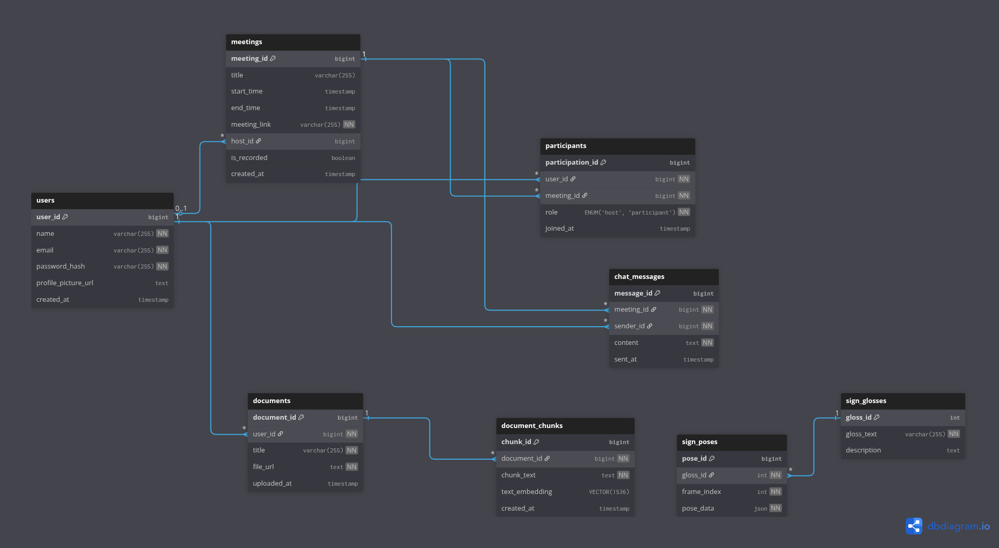

# SignSync Data Model

## 1. Overview

This document provides a detailed explanation of the database schema for the SignSync platform. The data model is designed for a TiDB database, leveraging its distributed SQL capabilities for scalability and its integrated vector search for AI-driven features.

The schema is organized into three distinct functional areas:

- **User & Meeting Management**: Core tables that handle user accounts, authentication, and the orchestration of real-time communication sessions.  
- **Document Explanation (RAG)**: Specialized tables that support the Retrieval-Augmented Generation pipeline, enabling the document analysis feature.  
- **Sign Language Animation**: A set of tables that act as a dictionary, storing the raw 3D pose data required to render sign language animations.  

---

## 2. Entity Definitions
This section breaks down each table, its columns, and its role within the overall system.

### `users`
Stores the primary information for each user account.  
**Purpose**: Manages user identity, credentials for authentication, and basic profile information.  

**Columns**:  
- `user_id` (BIGINT, PK, AUTO_RANDOM): Unique identifier.  
- `name` (VARCHAR): User’s display name.  
- `email` (VARCHAR, UNIQUE): User’s email (unique).  
- `password_hash` (VARCHAR): Hashed password.  

---

### `meetings`
Contains metadata for every meeting session.  
**Purpose**: Define and manage individual meeting rooms.  

**Columns**:  
- `meeting_id` (BIGINT, PK, AUTO_RANDOM): Unique meeting identifier.  
- `title` (VARCHAR): Optional meeting title.  
- `meeting_link` (VARCHAR, UNIQUE): Unique URL for joining.  
- `host_id` (BIGINT, FK): References `users.user_id`.  

---

### `participants`
Join table for many-to-many between users and meetings.  
**Purpose**: Track which users are in which meeting.  

**Columns**:  
- `user_id` (BIGINT, FK): References `users.user_id`.  
- `meeting_id` (BIGINT, FK): References `meetings.meeting_id`.  
- `role` (ENUM: 'host', 'participant'): Defines role in meeting.  

---

### `documents`
Metadata for uploaded documents.  
**Purpose**: Manage user-uploaded files.  

**Columns**:  
- `document_id` (BIGINT, PK, AUTO_RANDOM): Unique identifier.  
- `user_id` (BIGINT, FK): References `users.user_id`.  
- `title` (VARCHAR): Document title.  
- `file_url` (TEXT): Storage location (e.g., S3 URL).  

---

### `document_chunks`
Core table for AI-powered document explanation.  
**Purpose**: Store processed text chunks + embeddings.  

**Columns**:  
- `chunk_id` (BIGINT, PK, AUTO_RANDOM): Unique chunk identifier.  
- `document_id` (BIGINT, FK): References `documents.document_id`.  
- `chunk_text` (TEXT): Extracted snippet.  
- `text_embedding` (VECTOR(1536)): Embedding vector for semantic search.  

---

### `sign_glosses`
Dictionary for standardized sign language terms.  
**Purpose**: Map unique sign concepts to standardized gloss text.  

**Columns**:  
- `gloss_id` (INT, PK): Unique gloss identifier.  
- `gloss_text` (VARCHAR, UNIQUE): Standardized gloss (e.g., "HELLO-WAVE").  

---

### `sign_poses`
Frame-by-frame animation data for signs.  
**Purpose**: Provide sequential 3D pose data for animations.  

**Columns**:  
- `pose_id` (BIGINT, PK): Unique frame identifier.  
- `gloss_id` (INT, FK): References `sign_glosses.gloss_id`.  
- `frame_index` (INT): Sequential order of frame.  
- `pose_data` (JSON): Rotational data for bones in 3D hand model.  

---

## 3. Key Relationships
- **Users ↔ Meetings**:  
  - One-to-many via `meetings.host_id` (user hosts many meetings).  
  - Many-to-many via `participants` (users participate in many meetings).  

- **Users ↔ Documents**: One-to-many (user uploads many documents).  

- **Documents ↔ Chunks**: One-to-many (document split into chunks).  

- **Signs ↔ Poses**: One-to-many (gloss made of multiple poses).  
